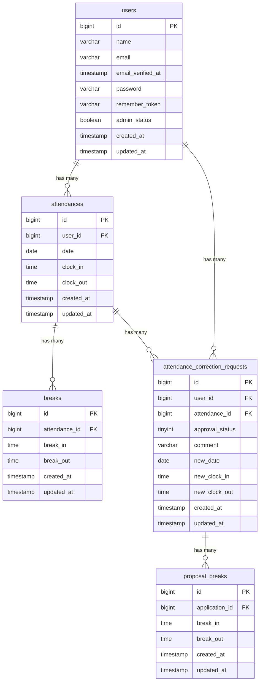

# COACHTECH お問い合わせフォーム

一般ユーザー向けの勤怠管理機能と、管理者向けの勤怠管理・修正申請管理機能を提供するWebアプリケーションです。

## 概要

一般ユーザーは、会員登録・ログイン後、出勤・休憩・退勤の打刻を行うことができます。
また、自身の勤怠一覧や勤怠詳細を確認し、勤怠内容の修正申請を行うことができます。

管理者はログイン後、全ユーザーの勤怠情報を確認・修正できるほか、スタッフ一覧や月次勤怠、一般ユーザーからの修正申請を確認し、承認することができます。

メール認証機能にはMailpitを使用し、開発環境内で認証メールの送受信を確認できる構成としています。

## 作成者

溝口　竣介

## 使用技術

- PHP 8.x
- Laravel 10.x
- MySQL 8.x
- Nginx
- Vite
- Mailpit
- Docker / Laravel Sail
- phpMyAdmin
- PHPUnit 10.x
- Git / GitHub

## ER図



## 開発環境URL

http://localhost

## 動作環境

本アプリケーションは**Docker（Laravel Sail）**を利用して動作します。

## 環境構築手順

1. **リポジトリをクローン**

    リポジトリをクローンします。
    ```bash
    git clone git@github.com:shunsukem1993-a11y/attendance-app.git
    ```
    クローンしたプロジェクトディレクトリに移動します。
    ```bash
    cd attendance-app
    ```

2. **.envファイルの準備**
    
    .env.exampleをコピーして.envファイルを作成します。
    ```bash
    cp .env.example .env
    ```

    .envのデータベース設定が以下になっていることを確認してください。

    ```env
    DB_CONNECTION=mysql
    DB_HOST=mysql
    DB_PORT=3306
    DB_DATABASE=laravel
    DB_USERNAME=sail
    DB_PASSWORD=password

    MAIL_MAILER=smtp
    MAIL_HOST=mailpit
    MAIL_PORT=1025

3. **Composer依存パッケージのインストール**

    コンテナを起動します。
    ```bash
    docker compose up -d
    ```
    Laravelコンテナ内でComposerを実行し、Composerで依存パッケージをインストールします。
    ```bash
    docker run --rm \
    -u "$(id -u):$(id -g)" \
    -v "$(pwd):/var/www/html" \
    -w /var/www/html \
    -e COMPOSER_CACHE_DIR=/tmp/composer_cache \
    laravelsail/php82-composer:latest \
    composer install --ignore-platform-reqs
    ```
    コンテナを停止します。
    ```bash
    docker compose down
    ```

4. **Laravel Sailの起動**

    Dockerコンテナを起動します。
    ```bash
    ./vendor/bin/sail up -d
    ```

5. **アプリケーションキーの生成**

    Laravelのアプリケーションキーを生成します。
    ```bash
    ./vendor/bin/sail artisan key:generate
    ```

6. **データベースのマイグレーションと初期データ投入**

    テーブルを作成し、必要に応じてシーダーを実行します。
    ```bash
    ./vendor/bin/sail artisan migrate --seed
    ```
    ※シーダーを使用していない場合は、以下を実行してください。
    ```bash
    ./vendor/bin/sail artisan migrate
    ```

7. **フロントエンドのビルド**

    Node.jsの依存パッケージをインストールし、開発用ビルドを実行します。
    ```bash
    ./vendor/bin/sail npm install
    ./vendor/bin/sail npm run dev
    ```

8. **アプリケーションへのアクセス**

    ブラウザで以下のURLにアクセスします。
    ```bash
    http://localhost
    ```

## テスト実行

PHPUnitによるテストを実行する場合は、以下のコマンドを実行してください。
```bash
./vendor/bin/sail test
```

特定のテストファイルのみを実行する場合は、以下のように指定できます。

テスト実装後記入

## 機能一覧

### 認証機能
- 一般ユーザー会員登録機能
- 一般ユーザーログイン・ログアウト機能
- 管理者ログイン・ログアウト機能
- メール認証機能
  - 会員登録時のメール認証
  - 初回ログイン時のメール認証
  - メール認証誘導画面表示
  - 認証メール再送機能
- バリデーション機能（FormRequest）
- 認証機能（Laravel Fortify）

### 一般ユーザー勤怠機能
- 勤怠登録機能
  - 現在日時表示機能
  - 出勤機能
  - 休憩開始機能
  - 休憩終了機能
  - 退勤機能
- 勤怠ステータス表示機能
- 勤怠一覧表示機能
- 月別勤怠表示機能
- 勤怠詳細表示機能
- 勤怠修正申請機能
- 勤怠修正申請バリデーション機能
- 勤怠修正申請エラー表示機能

### 一般ユーザー申請機能
- 修正申請一覧表示機能
- 承認待ち申請表示機能
- 承認済み申請表示機能
- 修正申請詳細表示機能
- 承認待ち申請の編集制限機能

### 勤怠レポート機能
- 自分の勤怠レポート表示機能
- 過去6ヶ月の総労働時間集計機能
- 総残業時間集計機能
- 平均労働時間集計機能
- 遅刻回数集計機能
- 早退回数集計機能
- 長時間労働回数集計機能

### 管理者勤怠管理機能
- 日次勤怠一覧表示機能
- 日付切り替え機能
- 勤怠詳細表示機能
- 勤怠直接修正機能
- 勤怠修正バリデーション機能
- 勤怠修正エラー表示機能

### スタッフ管理機能
- スタッフ一覧表示機能
- スタッフ別月次勤怠一覧表示機能
- 月別勤怠表示機能
- 勤怠詳細表示機能
- 勤怠情報CSV出力機能

### 修正申請管理機能
- 修正申請一覧表示機能
- 承認待ち申請表示機能
- 承認済み申請表示機能
- 修正申請詳細表示機能
- 修正申請承認機能
- 承認後の勤怠情報更新機能
- 承認後の申請ステータス更新機能

### データベース機能
- ユーザーと勤怠情報の1対多リレーション
- 勤怠情報と休憩情報の1対多リレーション
- ユーザーと修正申請の1対多リレーション
- 勤怠情報と修正申請の1対多リレーション
- 修正申請と修正案休憩情報の1対多リレーション

### 認可・アクセス制御
- 一般ユーザー向けアクセス制御
- 管理者ユーザー向けアクセス制御
- 認証済みユーザーのみアクセス可能な画面の制御
- 管理者のみアクセス可能な画面の制御

### その他
- メール送信機能（Mailpit）
- ダミーデータ作成機能（Seeder）
- バリデーション機能（FormRequest）
- PHPUnitによるテスト
- 勤怠データ集計


## APIエンドポイント一覧

本アプリケーションで提供している主なREST APIの一覧です。

勤怠API

| HTTPメソッド | URI | 概要 | 認証| 認証・認可 |
| ---------- | ---------------------------------------------- | ------ | --------- | --------------------------------------- |
| GET | /api/v1/attendance-records | 勤怠一覧を取得 | 不要 | 不要 |
| GET | /api/v1/attendance-records/{attendanceRecord}` | 勤怠詳細を取得 | 不要 | 不要 |
| POST | /api/v1/attendance-records` | 勤怠を新規登録 | Sanctum認証必須 | Sanctum |
| PUT | /api/v1/attendance-records/{attendanceRecord}` | 勤怠を更新 | Sanctum認証必須 | Sanctum + AttendanceRecordPolicy（本人のみ） |
| DELETE | /api/v1/attendance-records/{attendanceRecord}` | 勤怠を削除 | Sanctum認証必須 | Sanctum + AttendanceRecordPolicy（本人のみ） |
